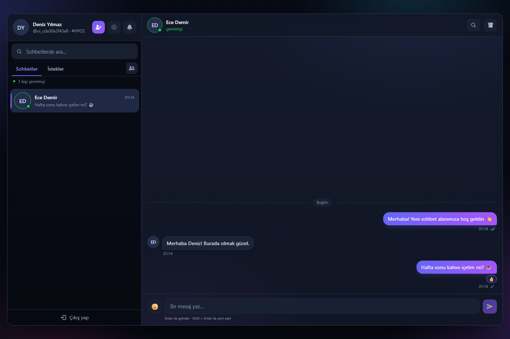
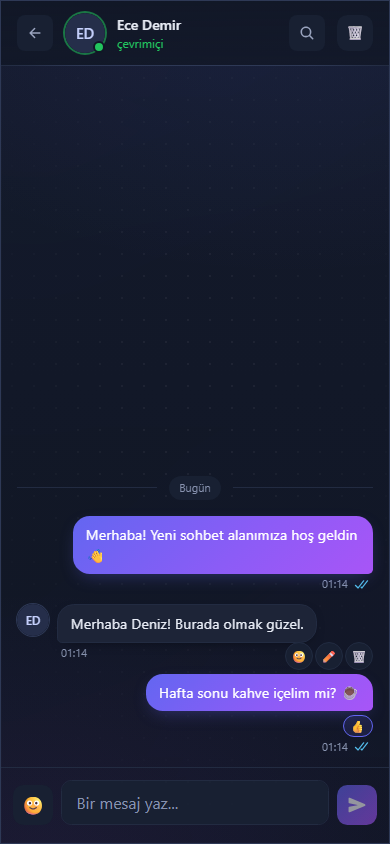

# Relay

[](https://github.com/ogulcantekines/Relay-Chat/actions/workflows/ci.yml)
[](https://github.com/ogulcantekines/Relay-Chat/actions/workflows/security.yml)
[](LICENSE)

A responsive one-to-one messenger built with React, Express, MongoDB and
Socket.IO. Friend requests, message requests, read receipts and reactions share
a Turkish dark interface that works on desktop and mobile.

Started in 2025 as a hands-on MERN learning project; revisited in 2026 with a focus
on reliable realtime behavior, security regression tests and reproducible Docker
packaging. The original explanatory comments are kept in the source.



<details>
<summary>Mobile view</summary>



</details>

## What it does

- Cookie-based login, editable profiles and password changes with session revocation.
- Find people by username or friend code; send, accept, reject and cancel requests.
- Persistent direct messages, typing, online presence, read receipts and unread counts.
- Edit/delete your messages, add emoji reactions and clear your own history.
- Load older messages in pages; search the loaded conversation.
- Recover state after reconnecting and keep your draft when a send fails.
- Keyboard-accessible account settings and responsive desktop/mobile layouts.

## Run locally with Docker

Requires Docker Engine/Desktop with Compose v2 or newer. No local Node.js or
MongoDB installation is needed.

1. Clone/download the repository and open its directory.
2. Copy `.env.example` to `.env` (`cp .env.example .env` on Linux/macOS,
   `Copy-Item .env.example .env` in PowerShell). Keep an existing `.env` if you have one.
3. Generate a secret and paste it into `JWT_SECRET` in `.env`:

   ```bash
   docker run --rm node:22-alpine node -e "console.log(require('crypto').randomBytes(48).toString('hex'))"
   ```

4. Start both services:

   ```bash
   docker compose up --build --detach --wait
   ```

Open **http://localhost:5000**. Register two accounts in separate browser profiles
or a regular/incognito window to try messaging. No shared demo password is shipped.

If port 5000 is busy, set `APP_PORT=5010` and
`CLIENT_URL=http://localhost:5010` in `.env`, then open that address.

```bash
docker compose ps            # app and database health
docker compose logs -f app   # server logs
docker compose down          # stop; saved messages remain in the named volume
```

The app port binds to **127.0.0.1** by default. MongoDB is not exposed on the host.
`docker compose down --volumes` permanently removes the database; it is not needed
for normal restarts or upgrades.

## Develop without Docker

Use **Node.js 22.12+** and a reachable MongoDB 7 database. Set `MONGO_URI` and
`JWT_SECRET` in `.env`, with `NODE_ENV=development` and
`CLIENT_URL=http://localhost:3000`.

```bash
npm run install:all  # npm ci for both lockfiles
npm run dev         # terminal 1: API on port 5000
npm run client      # terminal 2: Vite on port 3000
```

Vite proxies HTTP and Socket.IO to Express. For a production build, run
`npm run build`, set `NODE_ENV=production`, then `npm start`.

## Verify changes

Tests start their own server. They require an **explicit disposable** `MONGO_URI`
and reject a port already used by another application. They do not fall back to
the database in `.env`.

```bash
# Optional local database used only for tests
docker run -d --name chatapp-test-db -p 127.0.0.1:27018:27017 mongo:7
npm run install:all
npx --no-install playwright install chromium
npm run lint
```

Linux/macOS:

```bash
MONGO_URI=mongodb://127.0.0.1:27018/chatapp_test PORT=5100 npm run test:all
```

PowerShell:

```powershell
$env:MONGO_URI = 'mongodb://127.0.0.1:27018/chatapp_test'
$env:PORT = '5100'
npm run test:all
```

| Command | Coverage |
| --- | --- |
| `npm test` | HTTP auth, friends, messaging, profiles and clearing |
| `npm run test:realtime` | Real Socket.IO delivery between authenticated clients |
| `npm run test:security` | Impersonation, revocation, origin/ownership/input checks, pagination |
| `npm run test:ui` | Real Chromium: desktop/mobile chat, settings, failed sends and logout |
| `npm run test:all` | Build and all four test suites |

The browser suite saves screenshots and traces under `test-results/`. Inspect a
trace with `npx --no-install playwright show-trace test-results/desktop-trace.zip`.

## CI and security

GitHub Actions runs on pull requests to `main`, pushes to `main`/`release/**`, and
manual dispatch. It checks syntax, lint/build, integration/browser/security tests,
and the actual Compose stack. A separate workflow performs dependency auditing,
CodeQL analysis and full-history secret scanning; the container job scans its
runtime image. Actions use pinned revisions and scoped permissions. Test logs
and browser traces are retained as artifacts.

Repository rules still need to be enabled on GitHub after publishing. Workflow
files alone do not protect `main`. See [CONTRIBUTING.md](CONTRIBUTING.md).

This is a **single-instance, self-hosted application**. Messages are stored on the
server without end-to-end encryption. Group chat, uploads, calling, password
recovery and moderation are outside its current scope. See [SECURITY.md](SECURITY.md)
for reporting and security boundaries. Automated checks are not a completed pentest.

## Documentation

- [Local verification results](docs/VERIFICATION.md)
- [Architecture and design limits](docs/ARCHITECTURE.md)
- [API, pagination and socket events](docs/API.md)
- [Docker operations, backups and optional hosting](docs/DEPLOYMENT.md)
- [Contribution and commit workflow](CONTRIBUTING.md)

The app can remain a local Docker project. Hosting a live demo later is optional;
the same image can sit behind an existing HTTPS reverse proxy.

## License

[MIT](LICENSE) · [Oğulcan Tekineş](https://ogulcantekines.com)
