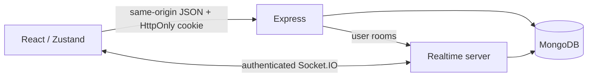

# Architecture and scope

This project began as a MERN learning project in 2025. The 2026 work builds on
that foundation with a revised interface, automated checks, Docker packaging,
and a review of authentication and realtime authorization. The original learning
comments in the source remain useful context.

## Runtime

The production container serves the Vite build, REST API and Socket.IO from one
origin. There is no separate frontend service to configure. Compose adds a MongoDB
container with a named volume; MongoDB has no published host port. The default app
port is bound to loopback for local use.

During development, Vite proxies `/api` and `/socket.io` to Express. Client bundles
contain no database credentials or signing secrets.

## Authentication and authorization

Passwords are hashed with bcrypt. The browser holds an HttpOnly session cookie;
React checks `/api/auth/me` before showing authenticated content. REST middleware
and the Socket.IO handshake validate the same session. A client-supplied user ID
is never an authorization credential.

The server checks message ownership, conversation membership and friend-request
ownership. Logout revokes the current session; a password change revokes older
sessions. Socket rooms deliver events to all connected tabs for a user.

## Messaging

MongoDB is the source of truth. HTTP mutations persist messages before realtime
events notify connected clients. The UI refreshes after reconnection to recover
changes missed while offline. Message history is loaded in bounded pages using
an older-message cursor.

Clearing history affects only the person who cleared it. Editing and deleting a
message require ownership. Read receipts, reactions and typing are supplemental
state; they do not replace the stored conversation history.

## Deliberate limits

- One application instance. Presence and rate-limit counters are process-local;
  multiple replicas need a shared Socket.IO adapter and rate-limit store.
- Text-based one-to-one messaging. No file uploads, group chat, voice/video calls,
  push notifications or email password recovery.
- Messages are stored on the server, without end-to-end encryption.
- User search is intended to help people find each other. This is not an anonymous
  or private-directory messenger.
- No background offline send queue. Failed sends keep their draft for retry.
- Docker provides a reproducible local setup. Public hosting, moderation, account
  recovery and service-level availability are separate operational decisions.

See [the security policy](../SECURITY.md) and [deployment notes](DEPLOYMENT.md)
for boundaries and optional hosting guidance.
